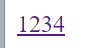
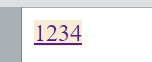
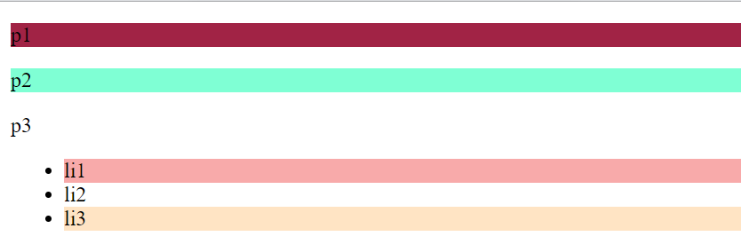
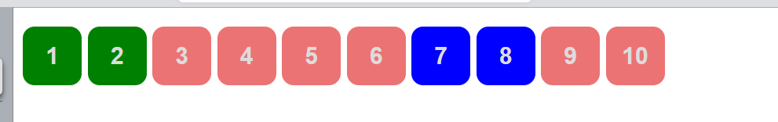
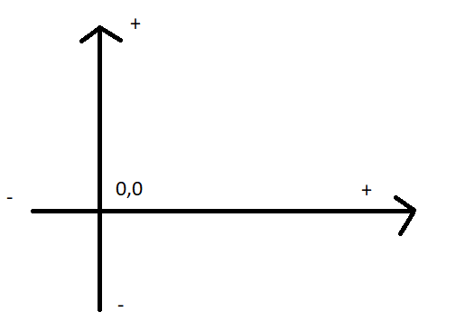
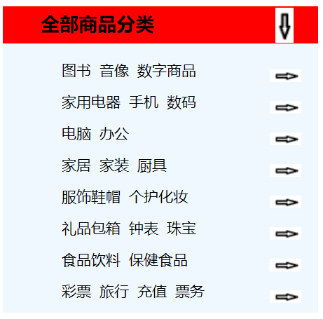
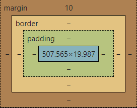

# 1.什么是CSS

1. 什么是CSS
2. CSS怎么用
3. **CSS选择器（重点+难点）**
4. 美化网页（文字、阴影、超链接、列表、渐变）
5. 盒子模型
6. 浮动
7. 定位
8. 网页动画（特效）

## 1.1 、什么是CSS

Cascading Style Sheet 层叠/级联样式表

CSS	表现（美化网页）

字体、颜色、边距、高度、宽度、背景图片、网页定位、网页浮动...

## 1.2、发展史

CSS1.0

CSS2.0  DIV （块）+ CSS ， HTML 和 CSS 结构分离的思想， 网页变得很简单 ，SEO（meta=“keywords” meta=“description”方便我们定位）

CSS2.1 浮动、定位

CSS3.0 圆角边框，阴影，动画... 浏览器兼容性~


练习格式


## 1.3、快速入门

style

**基本入门**

```html
<!DOCTYPE html>
<html lang="en">
<head>
    <meta charset="UTF-8">
    <title>Title</title>
    <!--规范，<style> 可以编写css代码，每一个声明，最好用分号结尾
        语法：
        选择器{
            声明1；
            声明2；
            声明3；
        }
    -->

    <style>
        h1{
            color: red;
        }
    </style>

</head>
<body>

    <h1>我是标题</h1>

</body>
</html>
```

推荐使用这种方式


**css的优势：**

1、内容和表现分离

2、网页结构表现一致，可以实现复用

3、样式十分丰富

4、建议使用独立于html的css文件

5、利用SEO，容易被搜索引擎收录


**CSS的三种导入方式**

```html
<!DOCTYPE html>
<html lang="en">
<head>
    <meta charset="UTF-8">
    <title>Title</title>
</head>

<!--内部样式-->
    <style>
        h1{
            color: red;
        }
    </style>
<!--外部样式,最常用-->
    <link rel="stylesheet" href="css/style.css">

<body>

<!--优先级：就近原则-->

<!--行内样式，在标签元素中，编写一个style属性，编写样式即可-->
    <h1 style="color: red">我是标题</h1>

</body>
</html>
```


拓展：外部样式两种写法

- 链接式 html

```html
<!--链接式-->
    <link rel="stylesheet" href="../1.我的第一个css程序/css/style.css">
```

- 导入式 css2.1 @import

```html
<!--导入式-->
<style>
	@import url("css/style.css");
</style>
```

首页link和import语法不同，前者\<link>是```html```标签,只能放入html源代码中使用，后者可以看作为css样式，作用是引入css样式功能。import在html使用的时候需要```<style type="text/css">```标签，同时可以直接“import url”(css文件路径地址)；放入css文件或css代码里引入的其他css文件。

本质上两者使用选择区别不大，但为了软件中编辑布局网页html代码，一般使用link较多，也推荐使用link。

# 2.选择器

作用：选择页面上某一个或某一类元素

## 2.1、基本选择器

1.标签选择器：选择一类标签 标签{}

```html
<!DOCTYPE html>
<html lang="en">
<head>
    <meta charset="UTF-8">
    <title>Title</title>

    <style>
        /*标签选择器，会选择到页面上所有的这个标签的元素*/
        h1{
            color: #f8aaaa;
            background: beige;
            border-radius: 24px;
        }
        p{
            font-size: 80px;
        }
    </style>

</head>
<body>


<h1>学Java</h1>
<h1>学Java</h1>
<p>听狂神说</p>

</body>
</html>
```

2.类选择器 .class：选择所有class属性一致的标签，跨标签 .类名{}

```html
<!DOCTYPE html>
<html lang="en">
<head>
    <meta charset="UTF-8">
    <title>Title</title>
    
    <style>
        /*类选择器的格式 .class名称{}
        好处，可以多个标签归类，是同一个class，可以复用
        
        */
        .qinjiang{
            color: #f8aaaa;
        }
        .kuangshen{
            color: aquamarine;
        }
    </style>

</head>
<body>

<h1 class="qinjiang">标题1</h1>
<h1 class="kuangshen">标题2</h1>
<h1 class="qinjiang">标题3</h1>

<p class="qinjiang">P标签</p>

</body>
</html>
```

3.id选择器 #id 全局唯一 #id名{}

```html
<!DOCTYPE html>
<html lang="en">
<head>
    <meta charset="UTF-8">
    <title>Title</title>

    <style>
        /*id选择器 ：id必须保证全局唯一！
        #id名称{}
        优先级
        不遵循就近原则，固定的
        id选择器> class 选择器 >标签选择器
        */
        #qinjiang{
            color: #f8aaaa;
        }
        .style1{
            color: beige;
        }
        h1{
            color: aquamarine;
        }
    </style>

</head>
<body>

    <h1 class="style1" id="qinjiang">标题1</h1>
    <h1 class="style1">标题2</h1>
    <h1 class="style1">标题3</h1>
    <h1>标题4</h1>
    <h1>标题5</h1>


</body>
</html>
```


***优先级：id > class > 标签***


## 2.2、层次选择器

1、后代选择器 在某个元素的后面 祖爷爷 爷爷  爸爸 你

```css
/*后代选择器*/
body p{
	background： red；
}
```

2、子选择器 一代，儿子

```css
/*子选择器*/
body>p{
    background: red;
}
```

3、相邻兄弟选择器 同辈的 同种标签

```css
/*相邻兄弟选择器： 只有一个，相邻（向下）*/
.active + p{
    background: red;
}
```

4、通用选择器 同种标签

```css
/*通用选择器，当前选中元素的向下的所有兄弟元素*/
.active~p{
    background: red;
}
```

## 2.3、结构伪类选择器

**伪类：条件过滤 **

<p>
&nbsp;&nbsp;&nbsp;&nbsp;例子==》a:hover<br/>&nbsp;&nbsp;&nbsp;&nbsp;这里的hover就是伪类==》a标签下的hover类：相当于所有标签自带的类（隐藏类），表示鼠标停留在该标签上，该标签的表现形式
</p>    

<table>
    <tr>
    	<td><strong>hover</strong></td>
        <td>鼠标悬停的状态</td>
    </tr>
    <tr>
    	<td>active</td>
        <td>鼠标按住未释放的状态</td>
    </tr>
    <tr>
    	<td>link</td>
        <td>没有访问的</td>
    </tr>
</table>

[^hover]: 重点记忆，其余为拓展，了解就好

以冒号开头的都是伪类，是一个过滤的作用

```css
a:hover {
	background: antiquewhite;
}
```





```css
<!DOCTYPE html>
<html lang="en">
<head>
    <meta charset="UTF-8">
    <title>Title</title>

    <style>
        /*ul的第一个子元素*/
        ul li:first-child{
            background: #f8aaaa;
        }
		/*ul的最后一个子元素*/
        ul li:last-child{
            background: bisque;
        }

    /*选中p1，定位到父元素，选择当前的第一个元素
    选择当前p元素的父元素，选中父元素的第一个，并且是当前元素才生效！
    按顺序
    */
        p:nth-child(1){
            background: #a12345;
        }
    /*选中父元素下的p元素的第一个，
    按类型
    */
        p:nth-of-type(2){
            background: aquamarine;
        }
    </style>


</head>
<body>

    <p>p1</p>
    <p>p2</p>
    <p>p3</p>
    <ul>
        <li>li1</li>
        <li>li2</li>
        <li>li3</li>
    </ul>

</body>
</html>
```



## 2.4、属性选择器(常用)

```html
<!DOCTYPE html>
<html lang="en">
<head>
    <meta charset="UTF-8">
    <title>Title</title>

    <style>
        .demo a{
            float: left;
            display: block;
            height: 50px;
            width: 50px;
            border-radius: 10px;
            background: aquamarine;
            text-align: center;
            color: gainsboro;
            text-decoration: none;
            margin-right: 5px;
            font: bold 20px/50px Arial;
        }
        a[id]{
            background: yellow;
        }
    /*属性名=属性值(正则)
    = 绝对等于
    *= 包含这个元素
    ^= 以这个开头
    $= 以这个结尾
    */

    /*存在id属性的元素    a[]{}*/
        a[class*="links"]{
            background: #ec7373;
        }
        /*选中href属性中以http开头的元素*/
        a[href^=http]{
            background: green;
        }
        /*选中href属性中以pdf结尾的元素*/
        a[href$=pdf]{
            background: blue;
        }

    </style>

</head>
<body>


<p class="demo">
    <a href="http://www.baidu.com" class="links item first" id="first">1</a>
    <a href="http://blog.kuangstudy.com" class="links item active" target="_blank" title="test">2</a>
    <a href="images/123.html" class="links item">3</a>
    <a href="images/123.png" class="links item">4</a>
    <a href="images/123.jpg" class="links item">5</a>
    <a href="abc" class="links item">6</a>
    <a href="/a.pdf" class="links item">7</a>
    <a href="abc.pdf" class="links item">8</a>
    <a href="abc.png" class="links item">9</a>
    <a href="abcd.jpg" class="links item last">10</a>

</p>

</body>
</html>
```



```htm
=
*=
^=
$=
```

# 3、美化网页元素

## 3.1、为什么要美化网页

1、有效的传递页面信息

2、美化网页、页面漂亮、才能吸引用户

3、凸显页面的主题

4、提高用户的体验


span标签：重点要突出的字，使用span套起来

```html
<!DOCTYPE html>
<html lang="en">
<head>
    <meta charset="UTF-8">
    <title>Title</title>

    <style>
        #title{
            font-size: 50px;
        }
    </style>

</head>
<body>

欢迎学习<span id="title">Java</span>

</body>
</html>
```

## 3.2、字体样式

```html
<!--
font-family: 字体,可以同时分别设置中英两种字体
font-size: 字体大小
font-weight: 字体的粗细
color: 字体颜色

-->
<style>
    body{
        font-family: Arial,楷体;
        color: #2c9ae1;
    }
    h1{
        font-size: 50px;
    }
    .p1{
        font-weight: bold;
    }
</style>
```

以上为学习拆解，真正应用一般为以下写法

```html
<style>
    p{
        /*斜体 加粗 字体大小/行高 字体*/
        font: oblique bolder 15px/30px "楷体";
    }
</style>
```

## 3.3、文本样式

1、颜色 color:	;  rgb rgba 

2、**文本的对齐方式 text--align = center**


3、**首行缩进 text-indent: 2em;**


4、**行高 line-height:**	单行文字上下居中！==》line-height=height


```html
<!--
颜色：
    单词
    RGB 0~F #0000FF
    RGBA A：0~1 rgba(0,255,255,0.9) a表示透明度

    text-align ： 排版 左右居中或左右对齐
    text-indent: 2em; 段落首行缩进

    height: 300px;
    line-height: 300px;
    	行高， 和 块的高度一致，就可以上下居中
-->
<style>
    h1{
        color: rgba(0,255,255,0.9);
        text-align: center;
    }
    .p1{
        text-indent: 2em;
    }
    .p3{
        background: blue;
        height: 300px;
        line-height: 300px;
    }
</style>

<h1>故事介绍</h1>
<p class="p1">
    这个世界名为元泱境界，脉（本质为振动）是构成万物的基础。每隔333年，会有一个神秘而强大的异常生物重生，它就是魁拔！魁拔的每一次出现，都会给元泱境界带来巨大的灾难！即便是天界的神族，也在劫难逃。在天地两界各种力量的全力打击下，魁拔一次次被消灭，但又总是按333年的周期重新出现。魁拔纪元1664年，天神经过精确测算后，在魁拔苏醒前一刻对其进行毁灭性打击。但谁都没有想到，由于一个差错导致新一代魁拔成功地逃脱了致命一击。很快，天界魁拔司和地界神圣联盟均探测到了魁拔依然生还的迹象。因此，找到魁拔，彻底消灭魁拔，再一次成了各地热血勇士的终极目标。
</p>
<p>
    在偏远的兽国窝窝乡，蛮大人和蛮吉每天为取得象征成功和光荣的妖侠纹耀而刻苦修炼，却把他们生活的村庄搅得鸡犬不宁。村民们绞尽脑汁把他们赶走。一天，消灭魁拔的征兵令突然传到窝窝乡，村长趁机怂恿蛮大人和蛮吉从军参战。然而，在这个一切都凭纹耀说话的世界，仅凭蛮大人现有的一块冒牌纹耀，不要说参军，就连住店的资格都没有。受尽歧视的蛮吉和蛮大人决定，混上那艘即将启程去消灭魁拔的巨型战舰，直接挑战魁拔，用热血换取至高的荣誉。
</p>
<p class="p3">
    Give me the strength lightly to bear my joys and sorrows.<br/>
    Give me the strength to make my love fruitful in service.<br/>
    Give me the strength never to disown the poor or bend my knees before insolent might.<br/>
    Give me the strength to raise my mind high above daily trifles.<br/>
    And give me the strength to surrender my strength to thy will with love.
</p>
```

5、装饰 **text-decoration:**

<table>
	<tr>
    	<td>下划线</td>
        <td>text-decoration: underline</td>
    </tr>
    <tr>
    	<td>中划线</td>
        <td>text-decoration: line-through;</td>
    </tr>
	<tr>
    	<td>上划线</td>
        <td>text-decoration: overline;</td>
    </tr>    
	<tr>
    	<td>超链接去下划线</td>
        <td>text-decoration: none</td>
    </tr>    
</table>

```html
<style>
    /*下划线*/
    .l1{
        text-decoration: underline;
    }
    /*中划线*/
    .l2{
        text-decoration: line-through;
    }
    /*上划线*/
    .l3{
        text-decoration: overline;
    }
    /*超链接去下划线*/
    a{
        text-decoration: none;
    }
</style>

<p class="l1">1231231</p>
<p class="l2">1231231</p>
<p class="l3">1231231</p>
<a href="123">123</a>
```


6、文本图片水平对齐： 

**a,b { vertical-align： middle; }**

```html
<style>   
    /*水平线对齐 参照物 a,b*/
    img,span{
        vertical-align: middle;
    }
</style>

<p>
    
    <span>ahdiaegfyis</span>
</p>
```


## 3.4、阴影(拓展了解)


```css
/*text-shadow: 阴影颜色，水平偏移，垂直偏移，阴影半径*/
#price{
    text-shadow: skyblue 1px -1px 2px;
}
```



## 3.5、超链接伪类

正常情况下，

**a， a:hover**  一般联合使用

```css
/*默认的颜色*/
a{
    text-decoration: none;
    color: black;

}
/*鼠标悬停的状态*/
a:hover{
    color: orange;
    font-size: 20px;
}
```

## 3.6、列表

**list-style**

```css
/*ul li*/
/*
list-style:
    none 去掉圆点
    circle 空心
    decimal 数字
    square 正方形
*/
ul{
    background: aliceblue;
}
ul li{
    height: 30px;
    list-style: none;
    text-indent: 1em;
}
```

## 3.7、背景

```css
div{
    width: 1000px;
    height: 700px;
    /*边框 大小 属性：直线 颜色：red*/
    border: 1px solid red;
    /*默认全部平铺*/
    background-image: url("images/tx.PNG");
}
.div1{
    background-repeat: repeat-x;
}
.div2{
    background-repeat: repeat-y;
}
.div3{
    background-repeat: no-repeat;
}
```

**练习**



## 3.8、渐变(拓展了解)

https://www.grabient.com/

```css
background-color: #0093E9;
background-image: linear-gradient(298deg, #0093E9 0%, #80D0C7 100%);
```

# 4、盒子模型

## 4.1、什么是盒子模型



margin：外边距

border：边框

padding：内边距


## 4.2、边框

1、边框的粗细

2、边框的样式

3、边框的颜色

```css
/*外边距*/
/*粗细 样式(实线solid 虚线dashed) 颜色*/
{
    border: 1px solid red;
}
{
    border: 1px dashed red;
}

```

## 4.3、内外边距

```css
/*内边距*/
h1{
	padding:
}

/*margin 外边距 上右下左 顺时针--margin: 1px 2px 3px 4px;*/
h1{
    margin: 10px auto;
}
```


盒子的计算方式：你这个元素到底多大？


margin+border+padding+内容宽度

## 4.4、圆角边框

border-radius: 

```html
/*左上 右上 右下 左下，顺时针方向*/
/*圆圈： 圆角 = 半径 宽为50的图，圆角为25就可以了*/
<style>
    div{
		width: 100px;
        height: 100px;
        border:10px solid red;
        border-radius: 100px;
    }
</style>
```

## 4.5、盒子阴影

```html
<!--margin: 0 auto;居中
	要求：块元素，有固定的宽度
-->

<style>
/*方法一:让img变成块元素,再定义外边距*/
    img{
        /*让img变成块元素*/
        display: block;
        /*再定义外边距*/
        margin: 0 auto;
    }
/*方法二:在img标签外套一个div标签==》把它放在块元素里，假装自己是个块元素*/    
    div{
        margin：0 auto;
    }    
</style>  
```

# 5、浮动

## 5.1、标准文档流

块级元素：独占一行（h1-h6 p div 列表……）

行内元素：不独占一行（span a img strong……）

行内元素 可以被包含在块级元素中，反之，则不可以

## 5.2、display

```html
<!--display:
    block 块元素
    inline 行内元素
    inline-block 保持了块元素属性的行内元素
    none 消失
-->

<style>
    div{
        width: 100px;
        height: 100px;
        border: 1px solid red;
        display:none
    }
    span{
        width: 100px;
        height: 100px;
        border: 1px solid red;
        display: inline-block   
    }
</style>
```

1.这个也是一种实现行内元素排列的方式，但是我们很多情况都使用float，因为用display的话，窗口大小改变了，网页内部会进行重新排版

## 5.3、float

1、float：左右浮动

```html
<!--float:
        left 左对齐(漂浮在父元素的上方)
        right 右对齐(漂浮在父元素的上方)
	clear:
		right 右侧不允许有浮动元素
		left 左侧不允许有浮动元素
		both 两侧不允许有浮动元素，既要漂浮又要是块元素
-->
```

```css
div{
    margin: 10px;
    padding: 5px;
}
#father{
    border: 1px solid red;
}
.layer01{
    border: 1px dashed yellow;
    display: inline-block
    float:right
}
.layer02{
    border: 1px dashed pink;
    display: inline-block
    float:right
}
.layer03{
    border: 1px dashed blue;
    display: inline-block
    float:right
}
.layer04{
    border: 1px dashed green;
    font-size: 12px;
    line-height: 23px
    display: inline-block
    float:right
}
```

## 5.4、父级边框塌陷的问题

clear

```css
/*
clear:
    right 右侧不允许有浮动元素
    left 左侧不允许有浮动元素
    both 两侧不允许有浮动元素
	none
*/
```


解决方案：

1、增加父级元素的高度

```css
#father{
    height: 10000px;
}
```

2、增加一个空的div标签，清除浮动

```html
<style>
    div{
        clear: both;
        margin: 0;
        padding: 0;
       
    }
</style>

<div class="div1"></div>
```

3.在父级元素中增加一个  overflow: hidden；

```css
<style>
/*overflow:
	hidden 超出隐藏
	scroll 超出设置滚动条
*/
    #content{
		width: 200px;
        height: 150px;
        overflow: hidden;
    }
</style>
```

**4.父类添加一个伪类 :after**

```css
#father:after{
    content: '';
    display: block;
    clear: both;
}
```


小结：

1.浮动元素后面增加空的div

​	简单，代码中尽量避免空div

2.设置父元素的高度

​	简单，元素假设有了固定告诉，就会被限制

3.overflow

​	简单，下拉的一些场景尽量避免使用

4.父类添加一个伪类：after(推荐)

​	写法稍微复杂一点，但是没有副作用，推荐使用


## 5.5、对比(display&float)

display 方向不可控

float 浮动起来的话会脱离标准文档流，所以要解决父级边框塌陷的问题


# 6、定位

## 6.1、相对定位

## 6.2、绝对定位
