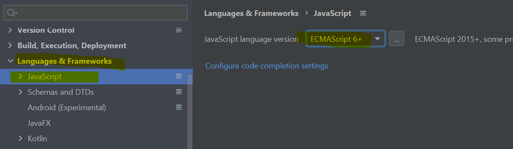
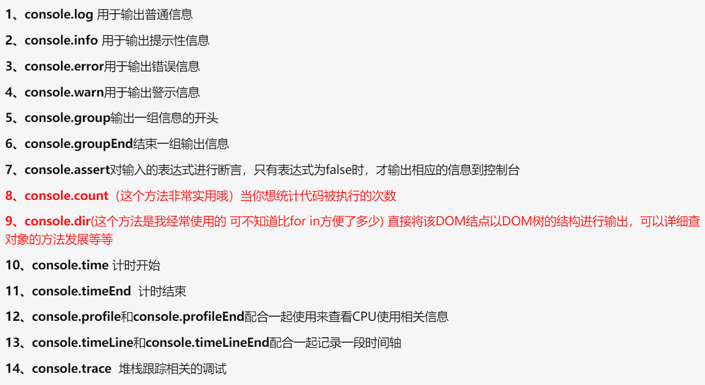

```html
利用a标签实现页面内位置的跳转
<a id="变量详解" href="">详解</a>
<a href="#变量详解">跳转到详解</a>
```

# 1、什么是JavaScript

# 2、快速入门

## 2.1、引入JavaScript

​	目前浏览器都是使用ECMA5.1，但是其自身已经升级到6，我们在编写时为了严格规范(更严谨)，通常会将setting中的JS修改成ECMA6



**引入**

```html
<!--外部引入 script标签是成对出现的-->
<script src="js/qj.js"></script>
```


## 2.2、基本语法入门

> **输入输出语句**

<table style="text-align:center">
    <tr>
    	<td>方法</td>
        <td>说明</td>
        <td>归属</td>
    </tr>
    <tr>
    	<td>alert(msg)</td>
        <td>浏览器弹出警示框</td>
        <td>浏览器</td>
    </tr>
    <tr>
    	<td>console.log(msg)</td>
        <td>浏览器控制台打印输出信息</td>
        <td>浏览器</td>
    </tr>    
    <tr>
    	<td>prompt(info)</td>
        <td>浏览器弹出输入框，用户可以输入</td>
        <td>浏览器</td>
    </tr>    
</table>

> **变量**：

​	定义：是内存当中的一个空间，用于存放数据

​	性质：可变

​	变量名：方便找到这个变量，读取数据

​	使用：申明+赋值


**定义变量**:

所有变量都用 var定义

严格区分大小写

```js
//1.变量类型 变量名 = 变量值,
    var num = 1;
    alert(num);

//2.条件控制
    if(){

    }else if(){

    }

//在浏览器的控制台打印变量 num
    console.log(num)
```


**浏览器必备调试须知**

<table>
    <tr>
    	<td>Elements:</td>
        <td>爬网站用(复刻网站)</td>
    </tr>
    <tr>
    	<td>Console</td>
        <td></td>
    </tr>
    <tr>
    	<td>Sources</td>
        <td>打断点,调试JS==>Breakpoints</td>
    </tr>
    <tr>
    	<td>Network</td>
        <td>抓包</td>
    </tr>
    <tr>
    	<td>Application</td>
        <td>>Cookies:重要，很多东西都是在这里面配置的</td>
    </tr> 
</table>

[^Breakpoints]: 断点,点击行号即打断点,刷新界面后可以点击进行调试

补充:console妙用




## 2.3、数据类型

数值、文本、图形、视频、音频


**定义变量**

```javascript
//变量名不能以数字、字符开头($、_除外)
let //局部变量
var //全局变量

```


### 详解

#### **Number**

```javascript
//JS不区分小数和整数，Number
    123 //整数123
    123.1 //浮点数123.1
    1.23e3 //科学计数法
    -99 //负数
    NaN //not a number
    Infinity //表示无限大
```

#### **字符串**

```javascript
'abc'
"abc"
```

#### **Boolean**

```javascript
true
false
```

#### **逻辑运算**

```javascript
&& 两个都为真，结果为真
|| 一个为真    
!  真即假，假即真   
```

#### **比较运算符**！！！！重要

```javascript
=
== 等于（类型不一样，值一样，也会判断为true）
=== 绝对等于（类型一样，值一样，结果true）
```

这是一个JS的缺陷，坚持不要用 == 比较


### 须知

​	NaN === NaN,这个与所有的数值都不相等,包括自己

​	只能通过 isNaN(NaN) 来判断这个数是否是 NaN


#### **浮点数问题**

```javascript
console.log((1/3) === (1-2/3));
```

> 尽量避免使用浮点数进行运算，存在精度问题，用绝对值 ***Math.abs*** 来约等于

[^Java]: BigDecimal
[^JavaScript]: Math.abs()

```javascript
Math.abs((1/3) === (1-2/3))<0.00000001;
```


#### **null 和 undefined**

- null 空
- undefined 未定义


#### **数组**

**定义**

> var arr = [1,2,3,4,5,'hello',null,true];

[^ps]: Java中的数组必须是相同类型的对象，JS中不需要这样

```javascript
//保证代码的可读性，尽量使用中括号的方式定义数组

//方法一
    var arr = [1,2,3,4,5,'hello',null,true];
//方法二
    new Array(1,2,3,4,5,'hello',null,true)；
```

**取值**

> arr[] ==> 取数组下标 ，如果越界了就会报 ``undefined``

```javascript
//通过下标访问数组    
    console.log(arr[0])
//
	arr.pop()
//
	arr.
```

**增加**

```javascript
//在尾部追加，永久生效 arr.push()
	var arr = [1,2]
    arr.push(3)
	console.log(arr)
	<[1,2,3]

//在尾部追加，临时生效，不改变原数组
	var arr = [1,2]
    var New_arr = arr.concat(3)
	console.log(arr)
	<[1,2]
	console.log(New_arr)
	<[1,2,3]
```

**修改/连接**

```javascript
	arr.join()
	
```


#### **对象** 

**定义**

> const 对象名{
>
> ​		属性1: 属性值,
>
> ​		属性2: 属性值,
>
> ​		属性3: 属性值
>
> }

[^ps]: JS，每个属性之间用","隔开,最后一个属性不需要添加

> 对象是大括号，数组是中括号

```javascript
//Java ==> Person person = new Person(1,2,3);

//JS，每个属性之间用 , 隔开，最后一个属性不需要添加
	var person = {
        name: "",
        age: "",
        tags: []
    }
```

**取值**

> 对象名.属性

```javascript
person.name
```

## 2.4、严格检查格式

```html
<!--
    前提：IDEA 需要设置支持ES6语法 setting 'use strict';严检查模式，预防JavaScript的随意性导致产生的一些问题
    必须写在JavaScript的第一行！
    局部变量建议都用let去定义
-->
  <script>
    'use strict';
    //全局变量
    let i = 1;
    //ES6 let
```


# 3、数据类型

## 3.1、字符串

1、正常字符串 我们使用单引号，或者双引号包裹

2、需要注意转义字符 \

```javas
\ '
\n
\t
\u4e2d \u#### Unicode字符串
\x41 ASCII字符
```

3、多行字符串 用反引号包裹

```javascript
var msg =
    	`hello
    	world
    	你好ya
    	你好`
```

4、模板字符串 \`string ${变量}`

```javascript
let name = 'qinjiang';
let age = 3;

let msg = `你好啊，${name}`
```

5、字符串长度

```javascript
str.length
```

6、字符串的可变性，不可变

```javascript
console.log(student[0])
< s
student[0] = 1
< 1
console.log(student)
< student
```

7、大小写转换

```javascript
//注意，这里是方法，不是属性
student.toUpperCase()
student.toLowerCase()
```

8、判断一个字符串里面是否存在特定的字符

```javascript
student.indexOf('t')
```

9、substring

```javascript
[)
student.substring(1)//把student看做数组，从下标1开始截取到末尾
student.substring(1,3)//下标1开始到2结束[1,3)
```

## 3.2、数组

> Array可以包含**任意的数据类型**

```javascript
var arr = [1,2,3,4,5,6];//通过下标取值和赋值
arr[0]
arr[0] = 1
```

**1、长度**

```javascript
arr.length
```

[^注意]: 加入给arr.length 赋值，数组大小就会发生变化，如果赋值过小，元素就会丢失

**2、indexOf()**	通过元素获得下标索引

```javascript
arr.indexOf(2)
< 1
```

[^注意]: 字符串中的'1'和数字 1 是不同的
[^玩玩,无视]: 如果想要通过这种方式，获取用push()压入的数组，一定是要被定义过的，即建议给push()压入的数组命名

```javascript
arr.push([2,3,4,5,6])
arr.push(4)
b = [2,3]
< (2) [2, 3]
arr.push(b)
< 4
arr
< (4) [1, Array(5), 4, Array(2)]
arr.indexOf(b)
< 3 //结果正确
arr.indexOf(Array(5))
< -1 //出错
```

**3、slice()**	切片

截取Array的一部分，返回一个新数组，类似于String中的substring

> **4、push()，pop()**	尾部

```javascript
push: 压入到尾部
pop: 弹出尾部的一个元素
```

[^玩玩,无视]: 如果push的是一个数组，那么这个数组会被作为一个整体被存储，访问时可以通过下标，但打印原数组时并不会被展示出来，而是显示 Array(数组长度)

```javascript
arr.push([2,3,4,5,6])
< 2
arr
< (2) [1, Array(5)]
arr[1]
< (5) [2, 3, 4, 5, 6]
```

> **5、unshift()，shift()**	头部

```javascript
unshift: 从头部插入一个元素
shift: 弹出头部的一个元素
```

**6、sort()**	排序 

```javascript
['b','a','c']
sort()
['a','b','c']
```

**7、reverse()**	元素反转

```javascript
['b','a','c']
reverse()
['c','a','b']
```

> **8、concat()**	

返回被连接的新数组

```javascript
['b','a','c']
arr.concat([1,2,3])
(6)['b','a','c',1,2,3]
arr
(3)['b','a','c']
```

[^注意]: concat()并没有修改数组，只是会返回一个新的数组

**9、join()**	连接符

打印拼接数组，使用特定的字符串连接，

```javascript
(3)['b','a','c']
arr.join('-') //()内可以是任意字符类型
"b-a-c"
```

[^注意]: 打印拼接数组，我们一般使用for遍历去实现

**10、多维数组**	了解即可

```javascript
arr = [[1,2],[3,4],["5","6"]];
//取值方式
arr[1][1]
< 4
arr[0][1]
< 1
```

[^玩玩 arr.fill()]: 把当前数组的所有值都进行填充

数组：存储数据（如何存，如何取，方法都可以自己实现！）


## 3.3、对象

**定义**

> const 对象名{
>
> ​		属性1: 属性值,
>
> ​		属性2: 属性值,
>
> ​		属性3: 属性值
>
> }

[^ps]: JS，每个属性之间用","隔开,最后一个属性不需要添加

> 对象是大括号，数组是中括号

```javascript
//Java ==> Person person = new Person(1,2,3);

//JS，每个属性之间用 , 隔开，最后一个属性不需要添加
	var person = {
        name: "",
        age: "",
        tags: []
    }
```

**取值**

> 对象名.属性

```javascript
person.name
```

# 进阶

## 数据类型

对象是存数据的，函数也是存数据，但是存的是代码数据

### 1、分类（值、引用）：

> **基本（值）类型：**

- String ：任意字符
- Number ：任意的数字
- boolean ：true false
- undefined ：undefined
- null：null

> **对象（引用）类型**

- Object ：任意对象
- Function ：一种特别的对象(可以执行)
- Array：一种特别的对象(数值下标,**内部数据是有序的**)

[^ps]: 对象：存数据     函数：存代码  数组:通过下标来操作数据


### 2、判断（typeof、instanceof、===）

- typeof：返回数据类型的字符串表达('string'、'number'、'boolean'、'undefined'、'object')

  ​	可以判断：undefined / 数值 / 字符串 / 布尔值

- instanceof：

  ​	判断对象的具体类型（函数/数组）

- ===

  ​	可以判断：undefined，null
  
  ​    因为undefined和null只有一个值

```javascript
//1.基本
	var a 
    console.log(a, typeof a)//undefined 'undefined' 
	console.log(typeof a==='undefined', a===undefined)//true true
	console.log(undefined==='undefined')//false
	
	a = 3
	console.log(typeof a==='number')//true
	a = 'aguigu'
	console.log(typeof a==='string')//true
	a = true
	console.log(typeof a==='boolean')//true
	a = null
	console.log(typeof a==='null', a===null)//object true

//2.对象
	var b1{
        b2: [1,'abc',console.log]
        b3: function(){
            console.log('b3')
            return function(){
                return 'xm'
            }
        }
    }

	console.log(b1 instanceof Object, b1 instanceof Array)//true false
	//instance:实例 of：属于哪个类型  A instanceof B -- A是不是B类型的实例，那么这个B就要是一个构造函数
	console.log(b1.b2 instanceof Array, b1 instanceof Object)//true true
	console.log(b1.b3 instanceof Function,b1.b3 instanceof Object)//true true

	console.log(typeof b1.b3==='function')//true

	console.log(typeof b1.b2[2]==='function')
	b1.b2[2](4)//4
	console.log(b1.b3()())//b3 xm
```

### 3.string ===> array

> split 分裂

```javascript
${str}.split('${分隔符}')
```


## 注意事项

深拷贝数据

清空缓存数据后要赋上新值
