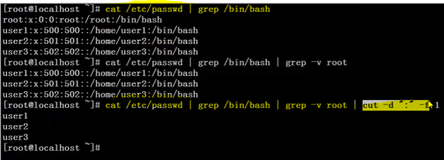

# 正则表达式

<table>
    <tr>
    	<td>符号</td>
        <td>含义</td>
        <td>举例</td>
    </tr>
    <tr>
        <td>*</td>
        <td>前一个字符出现0-n次</td>
        <td>a* aa* aaa*</td>
    </tr>
    <tr>
        <td>.</td>
        <td>表示任意<strong>一个</strong>字符<br/>
            匹配除换行符（\n、\r）之外的任何单个字符，相等于 [^\n\r]
        </td>
        <td>s.*d s..d</td>
    </tr>
    <tr>
        <td>^</td>
        <td>匹配行<strong>首</strong></td>
        <td>^h</td>
    </tr>
    <tr>
        <td>$</td>
        <td>匹配行<strong>尾</strong></td>
        <td>n$ ^$</td>
    </tr>
    <tr>
        <td>[]</td>
        <td>匹配除换行符以外的任意<strong>一个</strong>字符</td>
        <td>[a-z]</td>
    </tr>
    <tr>
        <td>[^]</td>
        <td>取反，匹配除了中括号以外的任意<strong>一个</strong>字符</td>
        <td>[^0-9] ^[^a-zA-Z]</td>
    </tr>     
    <tr>
        <td>\</td>
        <td>转义符</td>
        <td>\.$</td>
    </tr>      
    <tr>
        <td>\{n\}</td>
        <td>表示其前面的字符出现n次</td>
        <td>[0-9]\{3\}</td>
    </tr>
    <tr>
        <td>\{n,\}</td>
        <td>表示其前面的字符<strong>至少</strong>出现n次</td>
        <td>a\{2,\}</td>
    </tr>
    <tr>
        <td>\{n,m\}</td>
        <td>表示其前面的字符<strong>最少</strong>出现n次,<strong>最多</strong>出现m次</td>
        <td>[0-9]\{3,8\}</td>
    </tr>
    <tr>
    	<td>[\s\S]</td>
        <td>匹配所有。<br/>\s 是匹配所有空白符，包括换行<br/>\S 非空白符，不包括换行。</td>
        <td></td>
    </tr>
    <tr>
    	<td>\w</td>
        <td>匹配字母、数字、下划线。等价于 [A-Za-z0-9_]</td>
        <td></td>
    </tr>
</table>    

# 字符截取命令

## cut

```shell
选项：
	-f 2 file.txt:提取file的第二列字段
	-f 2,4 file.txt:提取file的第二和第四列字段
	-d 指定分隔符，默认是TAB键（制表符）

cut -d ":" -f 1,3 file.txt
```

## grep

```shell
选项：
	-v :取反
	-n :显示行号
	-m
	-o
	-r
```

**cut&grep联动，筛选指定字段，利用循环，实现批量操作**

```shell
#筛选系统中的所有普通用户--普通用户bin/bash 系统用户sbin/nologin
cat /etc/pawsswd | grep bin/bash | grep -v root | cut -d ":" -f 1

批量删除用户
#bin/bash!
x = $(cat /etc/pawsswd | grep bin/bash | grep -v root | cut -d ":" -f 1)
for i in x
	$()
```



## awk

```shell
#输出第二列信息，按TAB键分隔
awk '{print $2}'

#指定分隔符为 - 
awk -F "-" '{print $2}'

**option**
-F 指定分隔符
-v 
```

## curl 

alias：url下载工具

> 利用URL规则在命令行下工作的文件传输工具---http命令行工具。 支持文件的上传和下载，是综合传输工具

```shell
**basic usage**
#执行后，www.baidu的html就会显示在屏幕上，也可以用于测试一台服务器能否访问特定网站
	curl www.baidu.com
	
#
	curl www.baidu.com >> test.txt
#可以使用curl的内置选项 -o 保存网页
	curl -o test.txt www.baidu.com
	curl


**options**
-s/--silent 静音模式，不输出任何东西
-u/--user <user[:password]> 设置服务器的用户和密码
-o/--output 把输出写到该文件中 /dev/null 
-X/--request <command> 指定什么命令
-n/--netrc 从netrc文件中读取用户名和密码
-k/--insecure 允许不使用证书到SSL站点
-H/--header <line> 自定义头信息传递给服务器
-G/--get 以get的方式来发送数据
-w/--write-out [format] 设置访问完成后的输出内容及格式
-p/--proxytunnel 使用HTTP代理
-V/--version 显示版本信息

**example**
#测试网页返回值，在脚本中这是很常见的测试网站是否正常的用法
	curl -o /dev/null -s -w %{http_code} www.baidu.com
	
#-X GET
#-X POST
```

[^&amp;]: &
[^&apos;]: 单引号
[^&quot;]: 双引号
[^&gt;]: >
[^&lt;]: <
[^&nbsp;]: " "

## git clone

```shell
# only clone common-grat master branch for node_cfg usage:
git clone --quiet ${https://gerritmirror-ha.rnd.ki.sw.ericsson.se/a/grat/common-grat} --origin origin --single-branch --branch ${master} --reference /repo/grat.reference/repos/grat/common-grat
```


## df

```shell
选项：
	-h :人性化展示硬盘使用率
	
应用：
	定时检测硬盘使用率，使用率达80%时报警
```

# 常见命令

## ln -s

​	**创建软链接**:当在不同目录中使用相同的文件，可以使用ln命令链接，避免重复占用磁盘空间

## jq

​	**操作JSON**

> 安装

​	Ubuntu下

```shell
apt-get install jq
```

​	Others

```shell
yum -y install epel-release
yum -y install jq
```

> 使用

```shell
jq [option] filter [files]

**options:**
--version: 输出jq的版本信息并退出
--slurp/ -s: 读入整个输入流到一个数组。
--raw-input/ -R: 不作为JSON解析，将每一行的文本作为字符串输出到屏幕。
--null-input/ -n: 不读取任何输入，过滤器运行使用null作为输入。一般用作从头构建JSON数据
--compact-output /-c: 使输出紧凑，而不是把每一个JSON对象输出在一行。
--color-output / -C: 打开颜色显示
--monochrome-output / -M: 关闭颜色显示

--ascii-output /-a: 指定输出格式为ASCII

-raw-output / -r: 如果过滤的结果是一个字符串，那么直接写到标准输出（去掉字符串的引号）

**filter:**
.     : 默认输出
.foo  : 输出指定的数组元素，foo代表属性。
.[foo]: 输出指定数组元素。foo代表数组下标
.[]   :输出指定数组中的全部元素
，    :指定多个属性作为过滤条件时，用逗号分隔
|     :将指定的数组元素中的某个属性作为过滤条件

**files：**
	JOSN格式文件。
```

